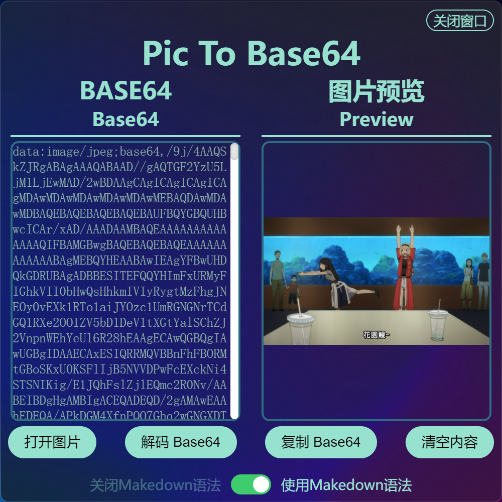

# 图片转 Base64 编码 (Vue版)

个人的一个 Vue + Electron 的练手项目，可以实现便捷的将图片转换为 Base64 编码形式。

## 项目预览



## ⬇下载

您可以直接到[Releases · Direct5dom/vue-pictobase64](https://github.com/Direct5dom/vue-PicToBase64/releases)下载已经打包好的软件。

## 🛠️构建

想要构建此项目，您需要：

```sh
git clone https://github.com/Direct5dom/vue-pictobase64.git
cd vue-pictobase64
yarn
```

> 此外，本项目使用了 [electron-acrylic-window](https://github.com/Seo-Rii/electron-acrylic-window)，需要 `msvc` 的支持。您需要安装 Visual Studio，并安装“使用 C++ 的桌面开发”。
> 
> 在非 Windows 10/11 的PC上，您可以忽略这一点。

运行：

```sh
yarn electron:serve
```

## 📦︎打包

想要打包此项目，您需要在项目根目录运行：

```sh
yarn electron:build
```

## ⚖️License

[MIT license](https://github.com/Direct5dom/vue-PicToBase64/blob/main/LICENSE)

## 依赖

[Seo-Rii/electron-acrylic-window](https://github.com/Seo-Rii/electron-acrylic-window)