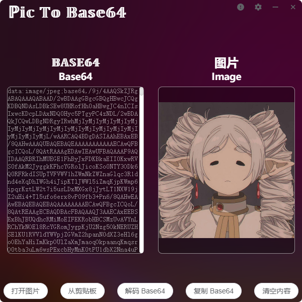

<p align="center">
  <h1 align="center">图片转 Base64（Pic to Base64）</h1>
  <p align="center">一个基于 Vue 的图片转 Base64 客户端。</p>
  <p align="center">
    <a href="https://github.com/SIXiaolong1117/vue-pictobase64/blob/master/LICENSE">
      
    </a>
    <a href="https://github.com/SIXiaolong1117/vue-pictobase64/releases">
      
    </a>
  </p>
  <p align="center">
    <a href="https://x.com/SI_Xiaolong">
      
    </a>
  </p>
</p>
<p align="center">
    
</p>

## 下载/Download

### 从 Releases 获取

您可以直接到[Releases · SIXiaolong1117/vue-pictobase64](https://github.com/SIXiaolong1117/vue-PicToBase64/releases)下载已经打包好的软件。

### 从 Microsoft Store 获取

[](https://apps.microsoft.com/store/detail/%E5%9B%BE%E7%89%87%E8%BD%ACbase64%EF%BC%88pic-to-base64%EF%BC%89/9NBF4FCR4T0G)

## 功能/Feature

|功能|实现情况|
|-|-|
|图片转 Base64|✔️|
|从本地打开图片|✔️|
|从剪贴板打开图片|⚠️（只支持截图工具写入剪贴板的图片，不支持复制图片文件后从剪贴板打开）|
|拖拽文件到应用界面打开图片|✔️|
|Base64 解码|✔️（直接将解码出的图片拖到本地即可）|
|复制时使用 Markdown 语法|✔️|

<!-- ✔️❌⚠️ -->

## 获取源码/Source Code

想要构建此项目，您需要：

```sh
git clone https://github.com/SIXiaolong1117/vue-pictobase64.git
cd vue-pictobase64
yarn
```

运行：

```sh
yarn electron:serve
```

打包：

```sh
yarn electron:build
```

## License

[MIT license](https://github.com/SIXiaolong1117/vue-PicToBase64/blob/main/LICENSE)